## a. Typical EEG sample set, b. Graph of LA-FS Costs
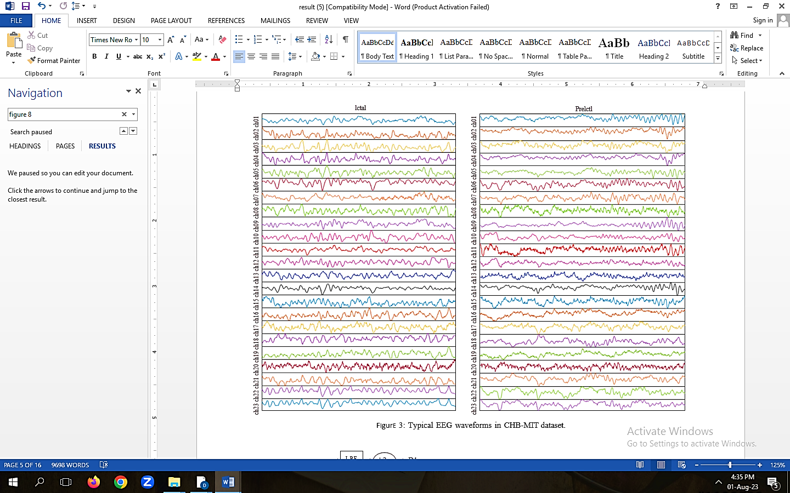 
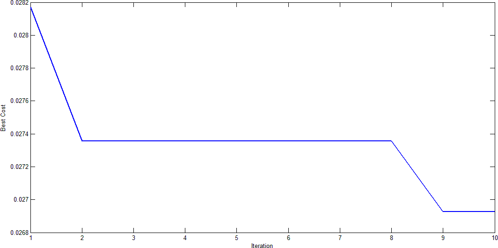 

## Confused Matrices of Multi-Class Database a) KELM b) LA-KEL
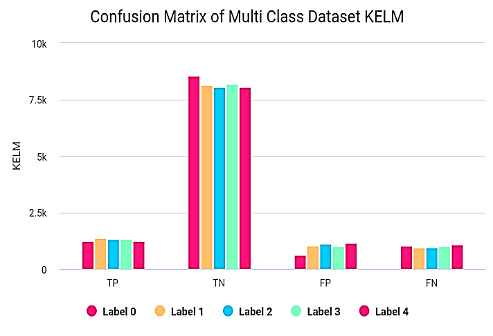 
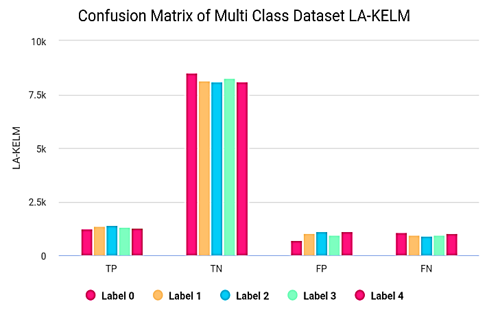 

## : Evaluation of various classification Class performances (a) KELM, (b) LA-KELM model
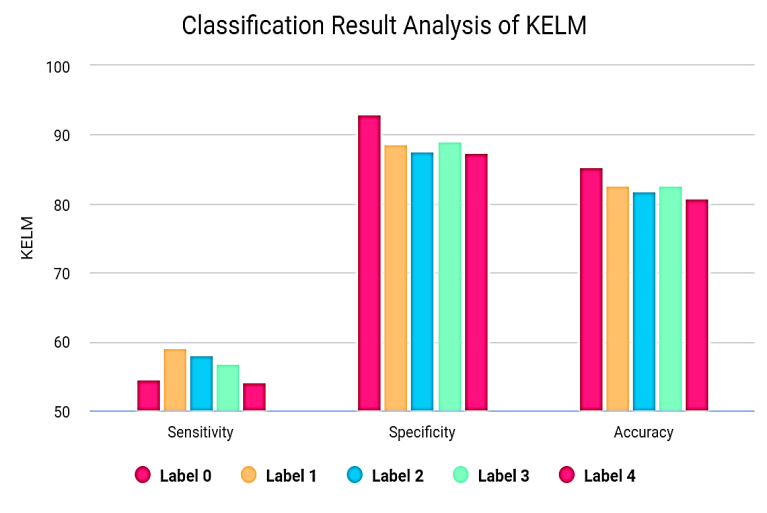 
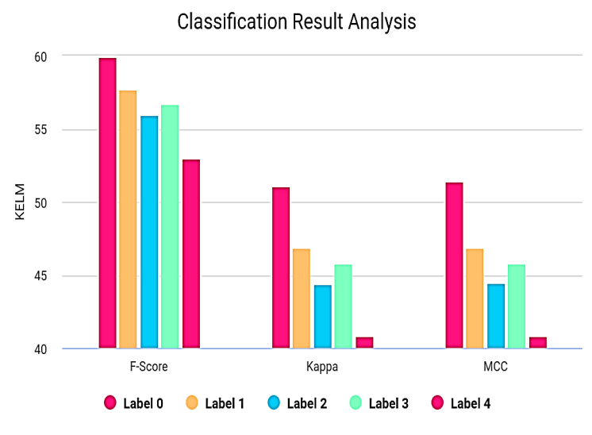 
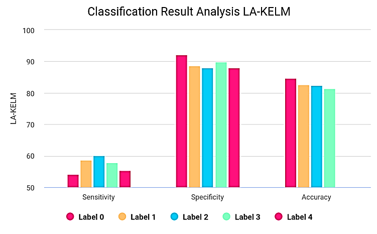 
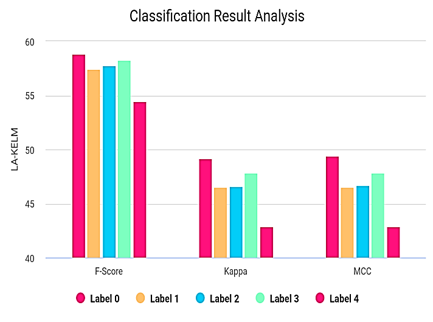 

## Classification of Results Analysis
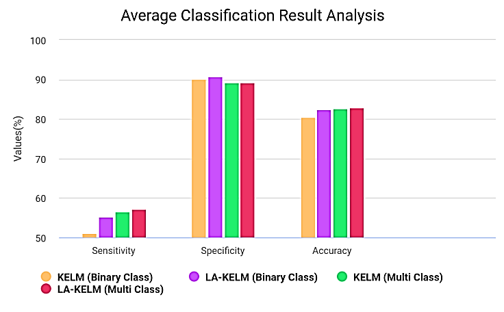 
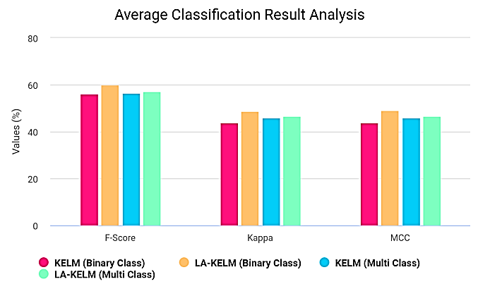 
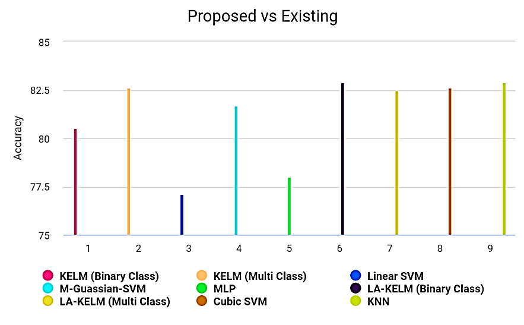 